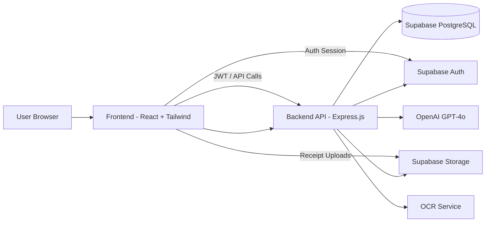
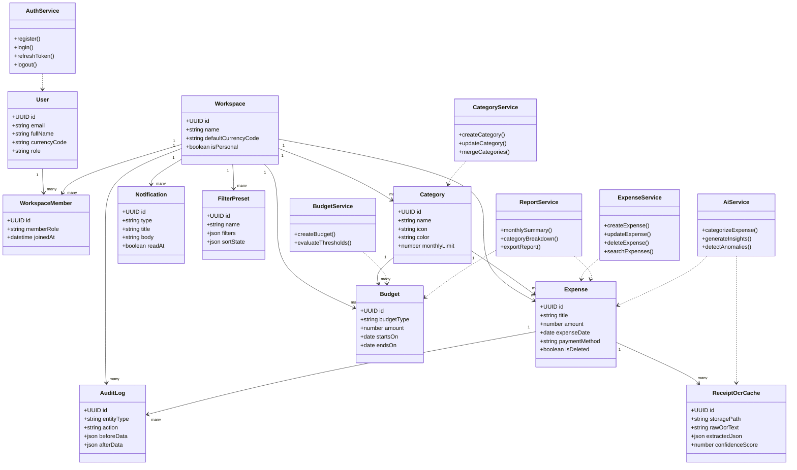
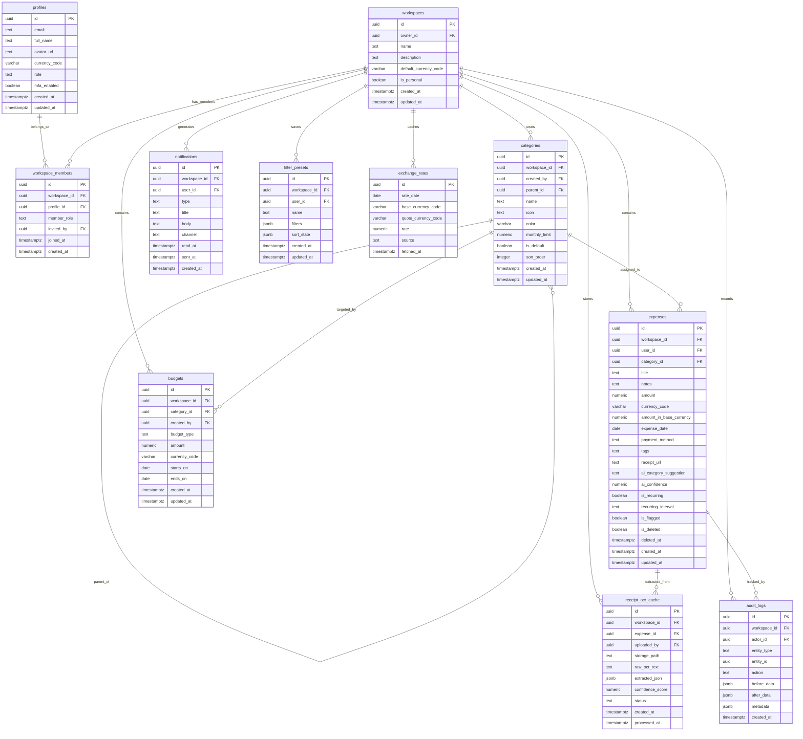

# Expense Tracker Overview

## 1. Project Overview

Expense Tracker is a full-stack financial tracking application for individuals, small teams, and families. It helps users record expenses, categorize spending, scan receipts, set budgets, receive alerts, and review insights through dashboards and reports.

### Key Goals

- Make expense entry fast and low-friction
- Support AI-assisted categorization and receipt scanning
- Provide clear monthly, category, and trend-based reporting
- Enable shared family expense tracking with combined totals
- Keep the system secure with authentication, RLS, and audit logging

### Core User Types

- Individual users tracking personal spending
- Families sharing a common expense pool
- Small business owners needing reports and exports
- Power users who want AI insights and anomaly detection

### Tech Stack

- Frontend: React 18 + Vite + Tailwind CSS
- Backend: Express.js + TypeScript
- Database: Supabase PostgreSQL
- Auth: Supabase Auth + JWT
- Storage: Supabase Storage
- AI: OpenAI GPT-4o
- OCR: Tesseract.js and AI post-processing

## 2. Architecture Diagram

### Flow Summary

- The frontend handles the user interface and sends API requests.
- The backend verifies JWTs, applies business rules, and coordinates AI/OCR operations.
- PostgreSQL stores all relational application data.
- Supabase Auth manages sign-up, login, OAuth, and session handling.
- Supabase Storage stores receipt images and export files.

## 3. Class Diagram

### Class Diagram Notes

- The domain model centers on workspace-scoped finance data.
- Services coordinate business logic rather than putting behavior inside the frontend.
- AI and OCR are treated as supporting services that enrich expense records.

## 4. ER Diagram

## 5. API List

### Authentication

| Method | Endpoint | Purpose |
|---|---|---|
| POST | /auth/register | Register with email and password |
| POST | /auth/login | Login and return JWT plus refresh token |
| POST | /auth/verify-email | Verify account email |
| POST | /auth/refresh | Refresh access token |
| POST | /auth/logout | Logout current session |
| POST | /auth/logout-all | Logout from all devices |
| POST | /auth/oauth/google | Google social sign-in |
| POST | /auth/oauth/github | GitHub social sign-in |

### User Profile

| Method | Endpoint | Purpose |
|---|---|---|
| GET | /me | Get current user profile |
| PATCH | /me | Update name, avatar, currency, or budget |
| POST | /me/mfa/setup | Start MFA setup |
| POST | /me/mfa/verify | Confirm MFA token |

### Expenses

| Method | Endpoint | Purpose |
|---|---|---|
| GET | /expenses | List expenses with filters and pagination |
| POST | /expenses | Create a new expense |
| GET | /expenses/:id | Get expense details |
| PATCH | /expenses/:id | Update an expense |
| DELETE | /expenses/:id | Soft-delete an expense |
| POST | /expenses/bulk-import | Import expenses from CSV |
| POST | /expenses/restore/:id | Restore a deleted expense |

### Categories

| Method | Endpoint | Purpose |
|---|---|---|
| GET | /categories | List categories |
| POST | /categories | Create category |
| PATCH | /categories/:id | Update category |
| DELETE | /categories/:id | Delete category and reassign expenses |
| POST | /categories/merge | Merge one category into another |

### Budgets & Alerts

| Method | Endpoint | Purpose |
|---|---|---|
| GET | /budgets | List budgets |
| POST | /budgets | Create budget |
| PATCH | /budgets/:id | Update budget |
| DELETE | /budgets/:id | Remove budget |
| GET | /alerts | List budget and anomaly alerts |

### Reports & Analytics

| Method | Endpoint | Purpose |
|---|---|---|
| GET | /analytics/monthly-summary | Monthly totals and remaining budget |
| GET | /analytics/category-breakdown | Category-wise spending summary |
| GET | /analytics/trends | Month-over-month trend data |
| GET | /analytics/heatmap | Daily spending heatmap data |
| GET | /reports/export | Export PDF or CSV report |
| GET | /insights/monthly | AI-generated spending insights |

### AI & OCR

| Method | Endpoint | Purpose |
|---|---|---|
| POST | /ai/categorize | Suggest a category for expense text |
| POST | /ai/scan-receipt | Extract receipt details from an image or PDF |
| POST | /ai/feedback | Store user feedback on AI suggestions |
| POST | /ai/anomalies/run | Trigger anomaly analysis |

### Notifications

| Method | Endpoint | Purpose |
|---|---|---|
| GET | /notifications | List notifications |
| PATCH | /notifications/:id/read | Mark notification as read |
| POST | /notifications/mark-all-read | Mark all notifications as read |

### Family Scope

| Method | Endpoint | Purpose |
|---|---|---|
| POST | /families | Create family group |
| POST | /families/invite | Invite a family member |
| POST | /families/invites/:token/accept | Accept invite |
| POST | /families/invites/:token/decline | Decline invite |
| GET | /families/:id | Get family details |
| GET | /families/:id/members | List family members |
| DELETE | /families/:id/members/:memberId | Remove a member |
| POST | /families/:id/leave | Leave family group |

## 6. Future Scope

The following items are important but can be scheduled after the core MVP:

- Mobile app using React Native or Expo
- Bank account sync and statement import
- Recurring expense auto-generation
- Advanced approval workflows for family or team expenses
- Budget recommendations using longer-term AI forecasting
- Custom report builder with drag-and-drop widgets
- Multi-tenant support for business teams and departments
- Offline expense entry with later synchronization
- Push notifications for mobile devices
- White-labeling and subscription plans
- Multi-language UI support
- Advanced tax and receipt compliance tools
- Scheduled monthly email digests with richer personalization

## 7. Summary

This overview captures the product structure, system architecture, core domain model, API surface, and future roadmap for Expense Tracker. It is intended as a high-level handoff document for planning, development, and project tracking.
