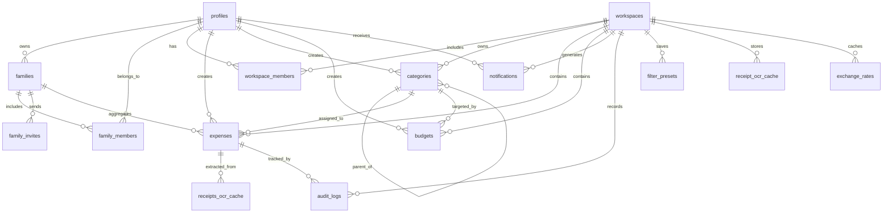

# Database Schema

This document defines the proposed PostgreSQL schema for Expense Tracker based on the PRD and technical stack. The schema is designed for Supabase, with Row Level Security enabled on all user-facing tables.

## 1. Design Principles

- Use UUID primary keys throughout.
- Track ownership through `user_id`, `family_id`, or `workspace_id` on every user-facing record.
- Keep core expense data normalized, while storing AI and OCR outputs in dedicated supporting tables.
- Support soft delete where the PRD requires recovery or auditability.
- Add indexes for common filter and reporting paths.

## 2. Core Entities



## 3. Tables

### 3.1 profiles

Stores the public user profile linked to Supabase Auth.

| Column | Type | Constraints | Description |
|---|---|---|---|
| id | uuid | PK, references `auth.users(id)` on delete cascade | User identifier |
| email | text | unique, not null | Primary email address |
| full_name | text |  | Display name |
| avatar_url | text |  | Profile image URL |
| currency_code | varchar(3) | not null, default 'INR' | Default display currency |
| role | text | not null, default 'member' | App role: `admin`, `member`, `viewer` |
| mfa_enabled | boolean | not null, default false | MFA status flag |
| email_verified_at | timestamptz |  | Verification timestamp |
| created_at | timestamptz | not null, default now() | Row creation time |
| updated_at | timestamptz | not null, default now() | Last update time |

### 3.2 families

Stores a shared family group where multiple users log and view combined expenses.

| Column | Type | Constraints | Description |
|---|---|---|---|
| id | uuid | PK | Family identifier |
| owner_id | uuid | not null, references `profiles(id)` | Family creator and admin |
| name | text | not null | Family display name (e.g., Sharma Family) |
| monthly_budget | numeric(12,2) |  | Optional combined monthly spending limit |
| currency_code | varchar(3) | not null, default 'INR' | Family reporting currency |
| invite_code | text | unique | Shareable join code for quick invites |
| is_active | boolean | not null, default true | Soft-disable family group |
| created_at | timestamptz | not null, default now() | Creation time |
| updated_at | timestamptz | not null, default now() | Last update time |

### 3.3 family_members

Maps users to a family with role-based access.

| Column | Type | Constraints | Description |
|---|---|---|---|
| id | uuid | PK | Membership identifier |
| family_id | uuid | not null, references `families(id)` on delete cascade | Family reference |
| profile_id | uuid | not null, references `profiles(id)` on delete cascade | Member reference |
| member_role | text | not null | `admin` or `member` |
| display_name | text |  | Optional nickname shown in family views |
| joined_at | timestamptz | not null, default now() | When the user joined |
| created_at | timestamptz | not null, default now() | Row creation time |

Recommended unique constraint: `(family_id, profile_id)`.

### 3.4 family_invites

Tracks pending and completed family invitations.

| Column | Type | Constraints | Description |
|---|---|---|---|
| id | uuid | PK | Invite identifier |
| family_id | uuid | not null, references `families(id)` on delete cascade | Target family |
| invited_email | text | not null | Email address of invitee |
| invited_by | uuid | not null, references `profiles(id)` | User who sent the invite |
| invite_token | text | unique, not null | Single-use secure token |
| status | text | not null, default 'pending' | `pending`, `accepted`, `declined`, `expired` |
| expires_at | timestamptz | not null | Invite expiry (default 7 days from creation) |
| responded_at | timestamptz |  | When invite was accepted or declined |
| created_at | timestamptz | not null, default now() | Row creation time |

### 3.5 workspaces

Supports personal and shared collaboration spaces.

| Column | Type | Constraints | Description |
|---|---|---|---|
| id | uuid | PK | Workspace identifier |
| owner_id | uuid | not null, references `profiles(id)` | Workspace owner |
| name | text | not null | Workspace name |
| description | text |  | Optional workspace description |
| default_currency_code | varchar(3) | not null, default 'INR' | Workspace currency |
| is_personal | boolean | not null, default true | Personal vs shared workspace |
| created_at | timestamptz | not null, default now() | Creation time |
| updated_at | timestamptz | not null, default now() | Last update time |

### 3.6 workspace_members

Maps users to shared workspaces with access control.

| Column | Type | Constraints | Description |
|---|---|---|---|
| id | uuid | PK | Membership identifier |
| workspace_id | uuid | not null, references `workspaces(id)` on delete cascade | Workspace reference |
| profile_id | uuid | not null, references `profiles(id)` on delete cascade | Member reference |
| member_role | text | not null | `admin`, `member`, or `viewer` |
| invited_by | uuid | references `profiles(id)` | Who sent the invite |
| joined_at | timestamptz |  | When the user joined |
| created_at | timestamptz | not null, default now() | Row creation time |

### 3.7 categories

Stores default and custom spending categories.

| Column | Type | Constraints | Description |
|---|---|---|---|
| id | uuid | PK | Category identifier |
| workspace_id | uuid | not null, references `workspaces(id)` on delete cascade | Owning workspace |
| created_by | uuid | references `profiles(id)` | Category creator |
| parent_id | uuid | references `categories(id)` on delete set null | Parent category for hierarchy |
| name | text | not null | Category name |
| icon | text |  | Emoji or icon key |
| color | varchar(7) |  | Hex color for UI |
| monthly_limit | numeric(12,2) |  | Optional category budget limit |
| is_default | boolean | not null, default false | Seeded system category |
| sort_order | integer | not null, default 0 | Manual ordering |
| created_at | timestamptz | not null, default now() | Creation time |
| updated_at | timestamptz | not null, default now() | Last update time |

### 3.8 expenses

Primary transaction table for all spending records.

| Column | Type | Constraints | Description |
|---|---|---|---|
| id | uuid | PK | Expense identifier |
| workspace_id | uuid | not null, references `workspaces(id)` on delete cascade | Owning workspace |
| family_id | uuid | references `families(id)` on delete set null | Family pool when expense is shared |
| user_id | uuid | not null, references `profiles(id)` | Member who logged the expense |
| category_id | uuid | references `categories(id)` on delete set null | Assigned category |
| expense_scope | text | not null, default 'personal' | `personal` or `family` |
| title | text | not null | Short description |
| notes | text |  | Additional notes |
| amount | numeric(12,2) | not null, check (amount > 0) | Original transaction amount |
| currency_code | varchar(3) | not null, default 'INR' | Original currency |
| amount_in_base_currency | numeric(12,2) |  | Normalized amount for reporting |
| expense_date | date | not null | Transaction date |
| payment_method | text | not null | `cash`, `card`, `upi`, `netbanking`, `other` |
| tags | text[] | not null, default '{}' | Searchable labels |
| receipt_url | text |  | Signed URL or storage path for receipt image |
| ai_category_suggestion | text |  | Suggested category label |
| ai_confidence | numeric(4,3) | check (ai_confidence >= 0 and ai_confidence <= 1) | AI confidence score |
| is_recurring | boolean | not null, default false | Recurrence flag |
| recurring_interval | text |  | `daily`, `weekly`, `monthly`, `yearly` |
| is_flagged | boolean | not null, default false | Anomaly flag |
| is_deleted | boolean | not null, default false | Soft delete flag |
| deleted_at | timestamptz |  | Soft delete timestamp |
| created_at | timestamptz | not null, default now() | Row creation time |
| updated_at | timestamptz | not null, default now() | Last update time |

### 3.9 budgets

Stores overall or category-specific spending targets.

| Column | Type | Constraints | Description |
|---|---|---|---|
| id | uuid | PK | Budget identifier |
| workspace_id | uuid | not null, references `workspaces(id)` on delete cascade | Owning workspace |
| category_id | uuid | references `categories(id)` on delete cascade | Optional category budget |
| family_id | uuid | references `families(id)` on delete cascade | Optional family-level budget |
| created_by | uuid | references `profiles(id)` | Budget creator |
| budget_type | text | not null | `monthly` or `yearly` |
| amount | numeric(12,2) | not null, check (amount > 0) | Budget amount |
| currency_code | varchar(3) | not null, default 'INR' | Budget currency |
| starts_on | date | not null | Budget start date |
| ends_on | date |  | Optional end date |
| alert_50_sent_at | timestamptz |  | Threshold alert marker |
| alert_80_sent_at | timestamptz |  | Threshold alert marker |
| alert_100_sent_at | timestamptz |  | Threshold alert marker |
| created_at | timestamptz | not null, default now() | Row creation time |
| updated_at | timestamptz | not null, default now() | Last update time |

### 3.10 notifications

Tracks in-app and email alert history.

| Column | Type | Constraints | Description |
|---|---|---|---|
| id | uuid | PK | Notification identifier |
| workspace_id | uuid | not null, references `workspaces(id)` on delete cascade | Owning workspace |
| user_id | uuid | not null, references `profiles(id)` on delete cascade | Notification recipient |
| type | text | not null | Budget, anomaly, summary, reminder, or verification |
| title | text | not null | Short notification title |
| body | text | not null | Notification message |
| entity_type | text |  | Related entity type |
| entity_id | uuid |  | Related entity identifier |
| channel | text | not null | `in_app`, `email`, or `push` |
| read_at | timestamptz |  | Read timestamp |
| sent_at | timestamptz |  | Delivery timestamp |
| created_at | timestamptz | not null, default now() | Row creation time |

### 3.11 audit_logs

Immutable event log for compliance and debugging.

| Column | Type | Constraints | Description |
|---|---|---|---|
| id | uuid | PK | Audit entry identifier |
| workspace_id | uuid | not null, references `workspaces(id)` on delete cascade | Owning workspace |
| actor_id | uuid | references `profiles(id)` | User who performed the action |
| entity_type | text | not null | Table or domain object name |
| entity_id | uuid |  | Affected record identifier |
| action | text | not null | `create`, `update`, `delete`, `restore`, `import`, `export` |
| before_data | jsonb |  | Snapshot before change |
| after_data | jsonb |  | Snapshot after change |
| metadata | jsonb | not null, default '{}' | Extra context such as IP or request id |
| created_at | timestamptz | not null, default now() | Event time |

### 3.12 exchange_rates

Caches daily forex rates for reporting and normalization.

| Column | Type | Constraints | Description |
|---|---|---|---|
| id | uuid | PK | Rate row identifier |
| rate_date | date | not null | Rate date |
| base_currency_code | varchar(3) | not null | Base currency |
| quote_currency_code | varchar(3) | not null | Target currency |
| rate | numeric(18,8) | not null, check (rate > 0) | Conversion rate |
| source | text | not null | Provider name |
| fetched_at | timestamptz | not null, default now() | Fetch timestamp |

Recommended unique constraint: `(rate_date, base_currency_code, quote_currency_code)`.

### 3.13 receipts_ocr_cache

Stores receipt extraction results to avoid repeated OCR processing.

| Column | Type | Constraints | Description |
|---|---|---|---|
| id | uuid | PK | Cache identifier |
| workspace_id | uuid | not null, references `workspaces(id)` on delete cascade | Owning workspace |
| expense_id | uuid | references `expenses(id)` on delete set null | Related expense |
| uploaded_by | uuid | references `profiles(id)` | Uploader |
| storage_path | text | not null | Private storage path |
| raw_ocr_text | text |  | OCR output |
| extracted_json | jsonb | not null, default '{}' | Structured parsed receipt data |
| confidence_score | numeric(4,3) | check (confidence_score >= 0 and confidence_score <= 1) | OCR confidence |
| status | text | not null | `pending`, `processed`, `failed` |
| created_at | timestamptz | not null, default now() | Creation time |
| processed_at | timestamptz |  | Completion time |

### 3.14 filter_presets

Saved search and filter configurations.

| Column | Type | Constraints | Description |
|---|---|---|---|
| id | uuid | PK | Preset identifier |
| workspace_id | uuid | not null, references `workspaces(id)` on delete cascade | Owning workspace |
| user_id | uuid | not null, references `profiles(id)` on delete cascade | Preset owner |
| name | text | not null | Display name |
| filters | jsonb | not null | Serialized filter state |
| sort_state | jsonb |  | Serialized sort state |
| created_at | timestamptz | not null, default now() | Creation time |
| updated_at | timestamptz | not null, default now() | Last update time |

## 4. Family Expense Aggregation

Family totals are computed at query time from the `expenses` table. No duplicate summary table is required for MVP.

**Total family spend (current month):**

```sql
SELECT COALESCE(SUM(amount_in_base_currency), 0) AS family_total
FROM expenses
WHERE family_id = :family_id
  AND expense_scope = 'family'
  AND is_deleted = false
  AND expense_date >= date_trunc('month', CURRENT_DATE)
  AND expense_date < date_trunc('month', CURRENT_DATE) + interval '1 month';
```

**Per-member breakdown:**

```sql
SELECT p.full_name, SUM(e.amount_in_base_currency) AS member_total
FROM expenses e
JOIN profiles p ON p.id = e.user_id
WHERE e.family_id = :family_id
  AND e.expense_scope = 'family'
  AND e.is_deleted = false
GROUP BY p.id, p.full_name
ORDER BY member_total DESC;
```

**Remaining family budget:**

```sql
SELECT f.monthly_budget - COALESCE(SUM(e.amount_in_base_currency), 0) AS remaining
FROM families f
LEFT JOIN expenses e
  ON e.family_id = f.id
 AND e.expense_scope = 'family'
 AND e.is_deleted = false
 AND e.expense_date >= date_trunc('month', CURRENT_DATE)
WHERE f.id = :family_id
GROUP BY f.id, f.monthly_budget;
```

## 5. Optional Supporting Tables

These tables are useful for the PRD, but can be added in later phases if needed.

### 5.1 recurring_rules

Stores recurrence logic separately if recurring expenses need richer scheduling.

### 5.2 expense_import_batches

Tracks CSV imports, validation status, row counts, and error summaries.

### 5.3 ai_feedback

Captures when users accept, edit, or dismiss AI category suggestions.

### 5.4 budget_alert_events

Records threshold and predictive alert generation for idempotency.

## 6. Recommended Constraints

- `profiles.email` should be unique.
- `families.invite_code` should be unique.
- `family_members` should enforce uniqueness on `(family_id, profile_id)`.
- `family_invites` should enforce one active pending invite per `(family_id, invited_email)`.
- `expenses.family_id` must be not null when `expense_scope = 'family'`.
- `categories` should enforce uniqueness for `(workspace_id, parent_id, name)`.
- `expenses` should enforce uniqueness on an import fingerprint if duplicate detection is implemented.
- `budgets` should enforce one active budget per `(workspace_id, category_id, budget_type, starts_on)` combination.
- `workspace_members` should enforce uniqueness on `(workspace_id, profile_id)`.

## 7. Recommended Indexes

- `expenses (family_id, expense_date desc)` where `expense_scope = 'family'` for family timeline queries.
- `expenses (family_id, user_id, expense_date desc)` for per-member family reports.
- `family_members (profile_id)` for resolving a user's family membership.
- `family_invites (invite_token)` for token lookup on accept.
- `expenses (workspace_id, category_id, expense_date desc)` for category reports.
- `expenses using gin (tags)` for tag search.
- `expenses using gin (to_tsvector('simple', title || ' ' || coalesce(notes, '')))` for full-text search.
- `categories (workspace_id, parent_id)` for hierarchical navigation.
- `budgets (workspace_id, category_id, starts_on)` for alert calculation.
- `notifications (user_id, read_at, created_at desc)` for inbox views.
- `audit_logs (workspace_id, created_at desc)` for compliance review.

## 8. Row-Level Security Strategy

- `profiles`: users can read and update their own row.
- `families`: only members can read a family; only admins can update family settings.
- `family_members`: members can read rows for their family; only admins can add or remove members.
- `family_invites`: admins can create invites; invitees can read invites sent to their email.
- `workspaces`: only members can read a workspace; only admins or owners can update it.
- `workspace_members`: members can read their membership rows; only admins can manage membership.
- `categories`, `expenses`, `budgets`, `notifications`, `audit_logs`, `receipts_ocr_cache`, `filter_presets`, `exchange_rates`: access must be limited to users who belong to the workspace or family linked to the record.

## 9. Notes For Supabase Implementation

- Use `auth.users` only for authentication; keep app profile data in `profiles`.
- Prefer `timestamptz` for all audit and event timestamps.
- Store receipt images in Supabase Storage and persist only the object path in the database.
- Use soft delete on expenses so the trash/recovery flow can be implemented without losing history.
- Generate and maintain derived reports from queries instead of storing duplicate summary tables unless performance requires caching.

## 10. Schema Summary

This schema supports the PRD requirements for:

- expense CRUD
- family groups with member invites and shared expense logging
- combined family expense totals and per-member breakdowns
- hierarchical categories
- budgets and alerts
- multi-user workspaces
- receipt OCR caching
- AI suggestions and anomaly tracking
- saved filters and search
- audit logging and security controls
